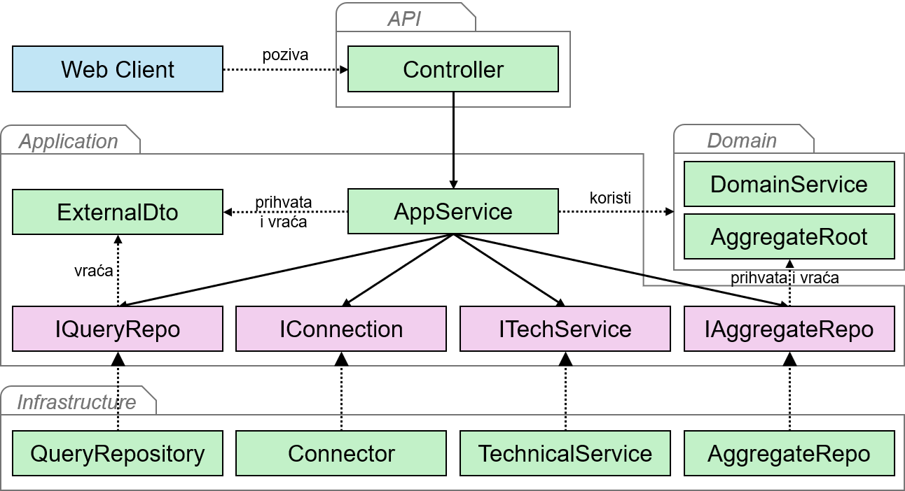

Prethodne lekcije su svaki sloj čiste arhitekture obradile zasebno, kroz klase koje mu pripadaju. Ovde slojeve sagledavamo zajedno. Pratimo jednu komandu i jedan upit od HTTP zahteva do HTTP odgovora, koristeći isključivo klase i metode koje su prethodne lekcije već definisale, a zatim precizno navodimo pravilo o zavisnostima između slojeva.

## Put komande

Ispitanik odgovara na pitanje, što obrađuje komanda `SubmitAnswerAsync` iz [lekcije o aplikacionom servisu](2-aplikacioni-sloj/2-aplikacioni-servis.md), kroz akciju iz [lekcije o API sloju](4-api-sloj.md).

1. Klijent šalje `POST /api/surveys/responses/{responseId}/answers` sa odgovorom u telu. Middleware za proveru identiteta čita token, rutiranje bira akciju `SubmitAnswer` kontrolera `SurveyRespondingController`, a vezivanje modela popunjava `responseId` iz adrese i `AnswerDto` iz tela.
2. Kontejner zavisnosti za ovaj zahtev pravi `SurveyRespondingService` sa oba repozitorijuma agregata i jedan `SurveyDbContext`, koji repozitorijumi dobijaju kao kontekst, a komanda kao `IUnitOfWork`.
3. Akcija poziva `SubmitAnswerAsync(responseId, answerDto)`.
4. Komanda kroz `ISurveyResponseRepository` traži odgovor ispitanika. `SurveyResponseRepository` izvršava `SELECT`, a kontekst rehidrira agregat i prati ga. Kada odgovor ne postoji, komanda baca `NotFoundException`.
5. Komanda kroz `ISurveyRepository` traži anketu po `SurveyId` učitanog odgovora. Anketa se učitava sa pitanjima, jer je tako konfigurisano.
6. Komanda od DTO strukture pravi vrednosni objekat `Answer`. Konstruktor proverava da odgovor nije prazan.
7. Komanda pita anketu `CanAccept(answer)` i, kada anketa prihvata odgovor, poziva `Record(answer)` nad odgovorom ispitanika. Pravila o objavljenoj anketi i aktivnom pitanju proverava anketa, a pravilo da se u predat odgovor ne može dodati odgovor proverava odgovor ispitanika.
8. Komanda poziva `SaveChangesAsync`. Kontekst poredi praćene objekte sa zapamćenim stanjem, sastavlja naredbe upisa samo za izmenjeni odgovor ispitanika i izvršava ih u jednoj transakciji.
9. Akcija vraća `NoContent()`, a radni okvir šalje odgovor sa statusnim kodom 204. Kontejner uništava kontekst.

Kada korak 4 baci `NotFoundException`, ili korak 6 ili 7 baci `DomainException`, izuzetak prolazi kroz komandu i akciju nepromenjen do middleware-a, koji ga prevodi u odgovor sa statusnim kodom 404, odnosno 400. Do koraka 8 se ne stiže, pa je baza nepromenjena.

## Put upita

Autor preuzima rezultate ankete kao PDF dokument. Upit koristi agregate, domenski servis `SurveyResultsCalculator` iz [lekcije o domenskom servisu](1-domenski-sloj/5-domenski-servis.md) i stručnjačku klasu iz [lekcije o ostalim infrastrukturnim servisima](3-infrastrukturni-sloj/6-ostali-infrastrukturni-servisi.md).

1. Klijent šalje `GET /api/surveys/{surveyId}/report`. Rutiranje bira akciju `GetReport` kontrolera `SurveyBrowsingController`, a vezivanje modela popunjava `surveyId`.
2. Kontejner zavisnosti pravi `SurveyBrowsingQueries` sa oba repozitorijuma agregata, domenskim servisom i `ISurveyReportGenerator`. Upitna klasa ne prima jedinicu posla.
3. Akcija poziva `GetReportAsync(surveyId)`.
4. Upit kroz repozitorijume učitava anketu i sve njene odgovore. Kada anketa ne postoji, upit baca `NotFoundException`.
5. Upit poziva `Calculate(survey, responses)` nad domenskim servisom, koji po domenskim pravilima broji predate odgovore na aktivna pitanja i vraća `SurveyResults`.
6. Upit poziva `Generate(results)` kroz interfejs. `PdfSurveyReportGenerator` kroz biblioteku sastavlja dokument i vraća niz bajtova.
7. Akcija vraća bajtove kao PDF datoteku sa statusnim kodom 200. Ništa nije upisano, a učitani agregati se odbacuju sa kontekstom.

## Odgovornosti po slojevima

Oba puta prolaze kroz iste četiri vrste odgovornosti:

| Sloj | Koraci komande | Koraci upita | Odgovornost |
|---|---|---|---|
| API | 1, 3, 9 | 1, 3, 7 | Prevodi HTTP zahtev u poziv i rezultat u HTTP odgovor. |
| Aplikacioni | 4 do 8, kao pozivalac | 4 do 6, kao pozivalac | Koordiniše korake slučaja korišćenja. |
| Domenski | 6, 7 | 5 | Proverava pravila, menja stanje i izvodi informacije. |
| Infrastrukturni | 4, 5, 8 | 4, 6 | Radi sa bazom i bibliotekama iza interfejsa aplikacionog sloja. |

Aplikacioni sloj u koracima 4 do 8 komande ne radi ništa sam. Svaki korak je poziv metode drugog sloja, a jedini kod koji mu pripada je redosled tih poziva.

## Zavisnosti između slojeva

Zavisnost jednog sloja od drugog postoji kada klasa jednog sloja direktno koristi tip iz drugog sloja. To se u kodu vidi kroz tip polja, parametra, povratne vrednosti, implementiranog interfejsa ili objekta koji se kreira.

Tok izvršavanja i smer zavisnosti nisu ista stvar. Tok izvršavanja komande prati redosled poziva:

```text
SurveyRespondingController
    -> SurveyRespondingService
        -> SurveyResponseRepository
            -> Baza podataka
```

Komanda tokom izvršavanja poziva infrastrukturni repozitorijum. Ipak, `SurveyRespondingService` ne referencira klasu `SurveyResponseRepository`, već interfejs `ISurveyResponseRepository` iz aplikacionog sloja. Isto važi za jedinicu posla, repozitorijum za čitanje i generator izveštaja.

Čista arhitektura prati princip inverzije zavisnosti, iz čega sledi:
- Domenski sloj ne zavisi ni od jednog drugog sloja.
- Aplikacioni sloj zavisi isključivo od domenskog sloja, čije tipove direktno koristi. Sposobnosti koje mu trebaju opisuje interfejsima koje sam deklariše.
- Infrastrukturni sloj referencira domenski sloj, jer radi sa tipovima agregata, i aplikacioni sloj, čije interfejse implementira. Uz njih referencira biblioteke i radne okvire potrebne za tehnički rad, koji ostaju u ovom sloju.
- API sloj zavisi isključivo od aplikacionog sloja, čije metode poziva i sa čijim DTO strukturama radi. Tipove domenskog sloja može da vidi, jer ih aplikacioni sloj koristi, ali ih ne sme koristiti. Kontroler uz to koristi tipove HTTP radnog okvira, koji ne prelaze u druge slojeve.

Sledeća slika prikazuje vrste klasa svakog sloja i zavisnosti između njih:



Smer zavisnosti ide od spoljašnjih slojeva ka unutrašnjim. U centru je domenski sloj, oko njega aplikacioni, a oko njega API i infrastrukturni sloj. U našem projektu su slojevi razdvojeni u zasebne projekte, a svako od navedenih pravila proverava [arhitektonski test](../3-modularni-monolit/4-arhitektonski-testovi.md).
