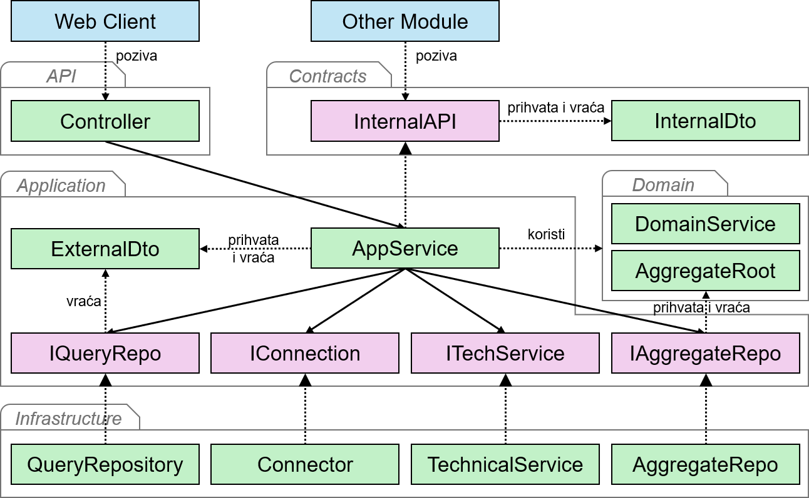

Aplikacija je podeljena na feature module koji poseduju sopstveni kod i sopstvene podatke. Postavlja se pitanje kako jedan modul dolazi do podatka koji poseduje drugi modul.

Posmatrajmo softver za istraživanje javnog mnjenja sa modulom Ankete, koji poseduje `Survey` i `SurveyResponse` agregate, i modulom Nagrade, koji ispitanicima dodeljuje poene za popunjene ankete. Modul Nagrade bi mogao direktno da učita `SurveyResponse` agregat ili da čita tabele modula Ankete. Takav potez bi spojio unutrašnjosti dva modula. Svaka promena domenskog modela ili šeme baze u modulu Ankete lomila bi kod modula Nagrade, a pravilo poput "računaju se samo predati odgovori" moralo bi da se ponovi van modula koji ga poseduje.

## Kontrakt

**Kontrakt** (engl. *contract*) je javna površina modula namenjena drugim modulima, koju čine interfejs sa operacijama koje modul nudi i DTO strukture koje te operacije prihvataju i vraćaju.

Modul Ankete definiše kontrakt kroz koji drugi moduli saznaju koje je ankete ispitanik popunio:

```cs
public interface ISurveyApi
{
  Task<List<CompletedSurveyDto>> GetCompletedSurveysAsync(Guid userId);
}

public sealed record CompletedSurveyDto(Guid SurveyId, string Title, DateTime CompletedAt);
```

U datom kodu treba uočiti sledeće:

- Kontrakt ne referencira nijedan drugi deo modula. Njegove DTO strukture sadrže proste tipove i identifikatore, pa modul Nagrade ne vidi agregate, repozitorijume ni bazu modula Ankete. U našem projektu kontrakt živi u zasebnom projektu `Contracts`, koji ne referencira nijedan drugi projekat, pa unutrašnjost modula ne može da procuri kroz njega.
- `CompletedSurveyDto` je odvojen od DTO struktura koje modul Ankete koristi za svoje kontrolere. Kontrakt se dogovara između timova dva modula i namerno je minimalan, jer sadrži samo podatke koje je modul Nagrade zatražio. Proširenje kontrakta je zato nov dogovor dva tima, a ne izmena unutar jednog modula.
- Poziv ide od modula kome podatak treba ka modulu koji ga poseduje. Modul Nagrade pita modul Ankete, a modul Ankete ne zna da modul Nagrade postoji.

## Implementacija i poziv kontrakta

Interfejs implementira klasa aplikacionog sloja modula Ankete, jer je odgovaranje na zahtev drugog modula slučaj korišćenja kao i svaki drugi. Implementacija se registruje u metodi proširenja modula, uz ostale klase modula:

```cs
services.AddScoped<ISurveyApi, SurveyApi>();
```

Klasa aplikacionog sloja modula Nagrade prima `ISurveyApi` kroz konstruktor, kao i svaki interfejs tehničke sposobnosti, i poziva ga kao običnu metodu:

```cs
public sealed class RewardQueries
{
  private const int PointsPerSurvey = 10;
  private readonly ISurveyApi _surveyApi;

  public RewardQueries(ISurveyApi surveyApi)
  {
    _surveyApi = surveyApi;
  }

  public async Task<int> GetPointsAsync(Guid userId)
  {
    var completedSurveys = await _surveyApi.GetCompletedSurveysAsync(userId);
    return completedSurveys.Count * PointsPerSurvey;
  }
}
```

U datom kodu treba uočiti sledeće:

- Kontejner zavisnosti pri obradi zahteva sastavlja `RewardQueries` sa instancom klase `SurveyApi`, iako modul Nagrade tu klasu ne vidi. To je moguće jer oba modula rade u istom procesu i dele isti kontejner. Isti poziv bi u mikroservisnoj arhitekturi išao preko mreže.
- Pozivalac ne zna niti ga zanima kako modul Ankete dolazi do odgovora. Pravilo o predatim odgovorima ostaje u agregatu `SurveyResponse` i primenjuje se unutar modula koji ga poseduje.
- Projekat aplikacionog sloja modula Nagrade referencira projekat `Contracts` modula Ankete i nijedan drugi njegov projekat.

Kontrakt je time druga javna površina modula, pored kontrolera. Kontroleri služe klijentskoj aplikaciji, a kontrakt služi drugim modulima. Sledeća slika prikazuje elemente jednog modula i njihove zavisnosti kada se kontrakt doda na slojeve čiste arhitekture, gde su interfejs i DTO struktura kontrakta označeni kao `InternalAPI` i `InternalDto`, a DTO strukture aplikacionog sloja kao `ExternalDto`:


